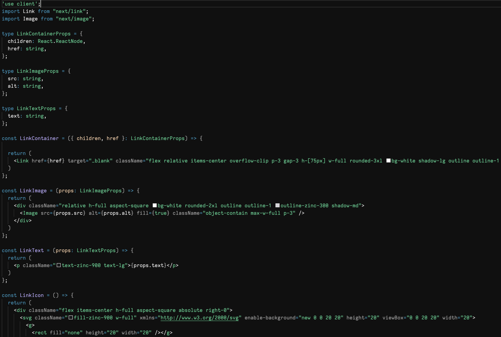

# Supabase VS Code Theme

A Supabase inspired VS Code theme.

Not affiliated with Supabase.

What it looks like:
<br />



## Installing `vsce`

`vsce` is the command-line tool you use to package and publish Visual Studio Code extensions. You can install it using different package managers:

### Using npm

If you have Node.js installed, you can use npm (Node Package Manager) to install `vsce` globally:

```bash
npm install -g vsce
```

### Using Yarn

If you prefer Yarn, another popular package manager, you can install `vsce` globally with:

```bash
yarn global add vsce
```

### Using pnpm

If you use pnpm, a fast, disk space-efficient package manager, install `vsce` with:

```bash
pnpm add -g vsce
```

After installation, you can check if `vsce` is correctly installed by running:

```bash
vsce --version
```

## Packaging the Extension

To package your VS Code theme into a `.vsix` file, follow these steps:

1. Ensure all dependencies are installed:

   ```bash
   npm install
   ```

2. Run the following command to create a `.vsix` package:

   ```bash
   vsce package
   ```

   This will generate a `.vsix` file in the root of your project directory.

## Installing the Extension in VS Code

After packaging your extension, you can install it in VS Code by following these steps:

### Method 1: Drag and Drop

1. Open VS Code.
2. Drag and drop the `.vsix` file into the Extensions view (`Ctrl+Shift+X` or `Cmd+Shift+X`).

### Method 2: Command Line

Alternatively, you can install the extension via the command line:

```bash
code --install-extension path/to/your-extension-name.vsix
```

Replace `path/to/your-extension-name.vsix` with the actual path to your packaged `.vsix` file.

## Development

If you want to work on the theme and test your changes live:

1. Open the project in VS Code:

   ```bash
   code .
   ```

2. Start the extension in development mode by pressing `F5` or selecting `Start Debugging` from the `Run` menu.

3. A new VS Code window will open with your theme loaded. Any changes you make to the theme files will be reflected here upon reload (`Ctrl+R` or `Cmd+R`).

## License

This project is licensed under the MIT License. See the [LICENSE](./LICENSE) file for more details.
    `
